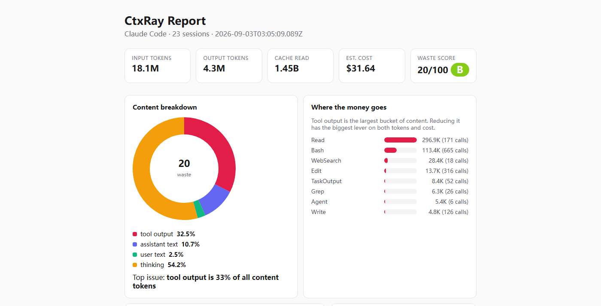

<div align="center">

# ctxray

**AI 编码 Agent 的「上下文碳足迹」体检工具。**

一条命令回答你的账单回答不了的问题:**我的 token 和钱,到底花在了哪里?**

`npx ctxray scan` → 找出浪费。`npx ctxray report --open` → 用报告说服你的团队。

🌍 **语言 / Language**: [🇺🇸 English](README.md) · [🇨🇳 简体中文](README.zh-CN.md) · [➕ 参与翻译](docs/i18n.md)

    

</div>

---

## 15 秒了解它

你的编码 Agent 每天都在烧 token。把它指向你的仓库,一上午它就会:

- 把**同一个文件反复读几十遍**(每次都整文件、全额计费),
- 用**模型根本不需要的 JSON 转储和工具原始输出**塞满上下文,
- 在**同一个报错**上循环,直到账单变得有趣,
- 为每个 MCP 服务器和 CLAUDE.md 规则,交一笔**每轮固定过路费**。

你感受到卡顿,你看到账单。但没人能告诉你,钱到底**去哪了**。

> 压缩类工具(headroom、context-mem...)做的是**事后**补救。
> **ctxray 先告诉你浪费在哪**——它是体检,告诉你该上哪种治疗。

## 亲自看一眼

我自己机器上的真实输出(最近 30 天,23 个 Claude Code 会话):

```text
CtxRay · Claude Code · 23 sessions
────────────────────────────────────────────────
tokens    input 18.1M · output 4.3M · cache read 1.45B
cost      $31.64 (approx, prices configurable)

content breakdown (1.5M tokens, all same measure):
  ███████              32.5%  tool output
  ██                   10.7%  assistant text
  █                     2.5%  user text
  ███████████          54.2%  thinking
  error output   9.5K tokens in error results

waste score 20/100 · grade B
top issue  tool output is 33% of all content tokens
re-reads   one doc x30, one util file x8, ...
top tools  Read 296.9K, Bash 113.4K, WebSearch 28.4K

suggestions
  - Reduce tool output: truncate large JSON results, or summarize inside the tool itself.
  - Same files read repeatedly: use a code-index (MCP) instead of raw reads.
```

thinking 原始占比最大(54%),但它不一定是浪费——评分优先标出**可避免**的噪音(工具输出 / 重复读取 / 报错)。在你自己机器上跑 `npx ctxray scan`,数字同样直接来自本地 Claude Code / Codex 日志,绝无估算。

真实扫描(23 个 Claude Code 会话)生成的 HTML 报告——自包含、离线可开、可分享:

<p align="center"></p>

## 快速开始

```bash
# 1. 查看 token 和钱花在了哪(最近 14 天):
npx ctxray scan

# 2. 生成可分享、离线可开的 HTML 报告:
npx ctxray report --open
```

仅此而已。只**在本地**读取会话文件——无需注册、无遥测、无网络请求。

想先试演示、不碰自己的数据?
```bash
git clone https://github.com/yuyuyu-dev/ctxray && npm install && npm run demo
# → 生成 dist-demo/ctx-report.html(基于合成测试数据)
```

## 它能查出什么——以及怎么治

| 查出的浪费 | 为什么烧钱 | 你得到什么 |
|---|---|---|
| **工具噪音** | JSON 转储、日志、搜索输出挤掉真正的推理空间 | 工具输出占内容 token 的百分比 + 按工具排名(`Read` vs `Bash` vs MCP) |
| **重复读取** | 同一个文件每轮以全价重新进上下文 | 具体文件与次数(`GameManager.tsx ×41`) |
| **报错循环** | 失败命令烧 token 且零产出 | 错误结果占了多少 token |
| **配置臃肿** | 每行 CLAUDE.md + 每个 MCP 服务器都是每轮过路费 | `audit-config`:每轮基线 + 预估月成本 + 整改清单 |
| **缓存低效** | 缓存命中率低 = 同样的前缀反复付全价 | 缓存复用率计入 Waste Score |
| **全局视角** | 每月没有成绩单 | **Waste Score 打分(A–F)** + 最该先修的一个问题 |

## 命令

| 命令 | 作用 |
|---|---|
| `scan` | 读取本地会话,拆解 token 与成本,写入快照。参数:`--agent claude\|codex\|auto`、`--since N`、`--project <slug>`、`--json` |
| `report` | 基于最新快照生成自包含离线 HTML 报告。参数:`--path <file>`、`--open` |
| `audit-config` | 估算 CLAUDE.md + MCP 服务器的每轮固定成本,并给出建议 |
| `ls-sessions` | 列出可扫描的会话:日期、项目、轮数、输入 token |

## 可分享的报告

`ctxray report` 产出**单个 HTML 文件**,所有内容内联:

- 总览卡片(input / output / cache / 成本 / 带等级徽章的 Waste Score),
- 内容构成环形图 + 烧钱工具 Top 榜(柱状图),
- 重复读取清单、错误输出、按优先级排序的建议,
- **零 CDN、零外部请求**——邮件发给同事、贴在工单里、飞机上离线打开都可以。

每份报告的页脚:*"This report is generated locally. No data leaves your machine."*

## 为什么还要一个工具?(诚实版)

| 工具 | 做什么 | 看完之后你 |
|---|---|---|
| **ccusage** | 统计你**花了多少**(记账) | "好吧,是挺多——然后呢?" |
| **headroom / context-mem** | 压缩上下文、**少花点**(治疗) | 你得先知道哪里臃肿才用得上 |
| **ctxray** | 指出浪费**在哪**、打分、指向第一个修复动作(诊断) | "原来如此——67% 工具输出、这 3 个工具、这个文件读了 41 次。" |

ctxray 和 ccusage **互补**:ccusage 回答"花了多少",ctxray 回答"花在哪、为什么"。两者共享同一份 JSONL 源文件。诊断是你整个省钱工具链的**上游入口**。

还没被打动?还有三个差异化:

- **数字可验证** —— 每轮总额直接取自 Agent 自己的 `usage` 字段,不是估算。
- **多 Agent 设计** —— Claude Code(已用真实会话验证)+ Codex(beta)一张报告,更多 Agent 在路线图上。
- **只读 + 本地优先** —— 不拦截、不改写、不代理、不上传你的数据。

## 工作原理

1. **精确计量** —— 每轮 input / output / cache token 直接取 Agent 的 `usage` 字段,零估算。
2. **归因** —— 零依赖启发式把总额分配到各组件(工具输出 / 用户文本 / 助手文本 / 思考);近似误差只进比例、不进总额。
3. **成本** —— 内置模型价格表(可覆盖),并按模型家族区分缓存记账语义(Anthropic 式 vs deepseek 式累加)。
4. **Waste Score** —— 透明的加权 A–F 评分(工具噪音 / 重复读取 / 无效输出 / 缓存利用),附排序建议。
5. **配置审计** —— 静态估算 CLAUDE.md + MCP 的每轮基线与月成本。

## 支持的 Agent

| Agent | 状态 |
|---|---|
| Claude Code | ✅ 已用真实会话验证 |
| Codex | 🧪 基于社区文档化 rollout 格式;若遇到解析失败的格式请提 issue |
| Gemini CLI、Cursor... | 🚧 路线图 |

## 隐私与信任

- **只读** —— 只碰 `~/.claude` 和 `~/.codex`,绝不修改任何会话文件。
- **100% 离线** —— v1 零网络请求,报告是自包含单文件。
- **数据最小化** —— 快照只存聚合数字,绝不存你的代码或提示词;`reportHash` 为 v2 匿名汇总预留。

## 开发

```bash
npm install
npm run dev -- scan      # 开发模式运行
npm run demo             # 基于合成数据生成演示报告
npm test                 # vitest(39 个测试)
npm run build
```

## 许可证

MIT —— 自由使用、fork 与分发。

